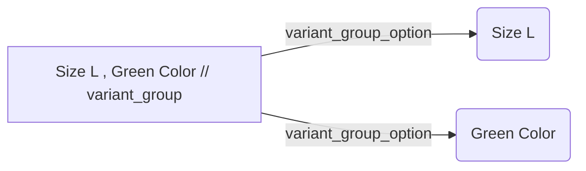

#  :sunglasses: Welcome to My E-Commerce DATABASE

Hi! I am Emre. In this project, you will see the details of the e-commerce database that I designed as a result of long efforts. If you are asking how to design an e-commerce database, you are at the right place.  :ok_hand:

## :point_down: Tables
- banks
- brands
- cargo
- categories
- currency
- discount_types
- img
- members
- member_addresses
- member_price_alarm
- member_stock_alarm
- migrations
- newsletter
- orders
- orders_cargo
- orders_installment
- order_dtl
- order_dtl_discount
- panel_users
- panel_user_types
- password_resets
- products
- product_comments
- product_discount
- product_dtl
- product_units
- product_variants
- product_variant_group
- product_variant_group_option
- status_list
- status_list_types
- stores
- users

## :star2: Database Schema And Relationships

## :100: Facilities Provided By The System

- The greatest opportunity provided by the database acts with **the minimum amount of data repetition.**

-  It supports about **100k products (including variants)** with mysql.

- **Thanks to easy product - variant matching**, you can code the entire system without causing any difficulties and code confusion.

- You can create **unlimited variants** and add them to your products.

## Documentation

### products Table

In this table, the features that a product will not change according to the variant are kept. For example, the fact that a sweater is different in color does not change its category. So brand, category, unit, ranking etc. values are kept here.

### product_dtl table

In this table, unlike the products table, values that vary according to the variant are kept. For example, information such as product code, stock code, price, shipping day and duration may vary in red and blue types of a product.

### product_discount and discount_types
A product can have more than 1 discount type. We can make examples such as basket discount, product discount, EFT discount. Instead of preparing separate structures for these, it seemed more correct to keep all the discounts related to the product in a separate table. In this way, we can combine all discount types and campaigns of the product at once and easily perform all our calculations. In this way, there is no need for a crowd of queries such as "Bring campaign discount from x tables" or "Bring cart discount from x tables".

### product_variants - product_variant_group and product_variant_group_option

This is the structure that is difficult to understand in this system, but very easy to use when understood.
- **product_variants**
> in this table variants are grouped together with a parent_id. For example, when a variant with an id of 5 is entered in the name "length" and contents such as "1 meter" , "2 meters" are entered as sub-variants, the parent_id of these sub-variants will be 5.

- **product_variant_group**
>Suppose we have a sweater. get 2 variants of this sweater in size and color. When we group these variants, we get an example of a variant group as "color red - size XL" or "color green - size L". Here, the groups we have specified are kept in this table.

- **product_variant_group_option**
>Since we cannot collect the variants that we grouped in the above example in a single row, we do the separation in this table. that is, for the variant group "size L - green color", 2 rows are formed in this table. "L size" is kept in row 1 and "Green color" is kept in row 2. in these groups, they are associated with the group_id in the table above.

- **orders , order_dtl and order_dtl_discount , orders_installment , orders_cargo tables**
These tables have approximately the same properties as the products, products_dtl, products_discount tables. Information about the ordered product and the person placing the order is kept in these tables. At the same time, you can keep information such as payment types (bank card, eft, etc.), cargo information, and installment options for the order placed in these tables.

- **status_list and status_list_types**
As those who deal with database operations can guess, every data has a state. For example, "deleted, hidden, etc." for products. or for orders "shipped, cancelled, awaiting confirmation, etc." or "Pending approval, blocked, deleted etc." for users. You can keep these states in these tables, and group them according to your tables.

-**members , member_addresses, member_price_alarm , member_stock_alarm**

These tables are for users only. User's contact and address information is kept. At the same time, the tables that allow the user to be notified when it comes to stock and to be notified when the price drops are also here. 
>**Note:** There is no structure in the current structure where you can add products to favorites. You can also create this table yourself by referring to the existing stock and price alarm tables.

### You can access and test the e-commerce project where the system is running from [#this repo](https://github.com/emrekaradag11/ecommerce).

## This is the preliminary information I will convey about the system. Apart from this information, if you can send me all the questions you want to ask via my [e-mail address](mailto:hello@byexit.com), we can exchange ideas.

# :heart_eyes: Happy Coding Guys :heart_eyes:
